# Screenshots

## Request flow

### Identifying yourself

Show gallery

::: {layout-ncol=2}

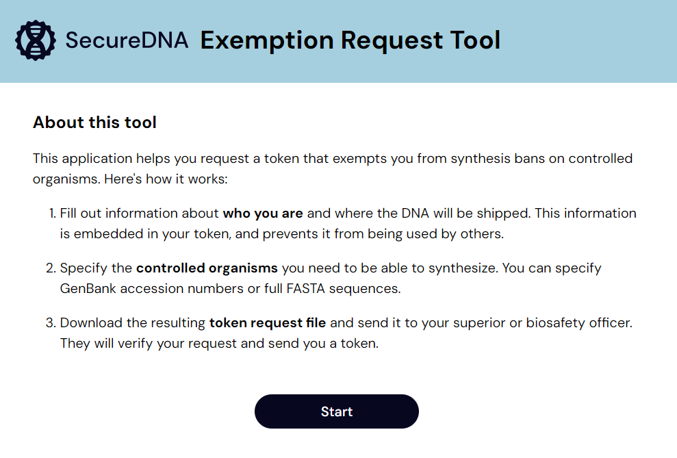{group="specifying"}

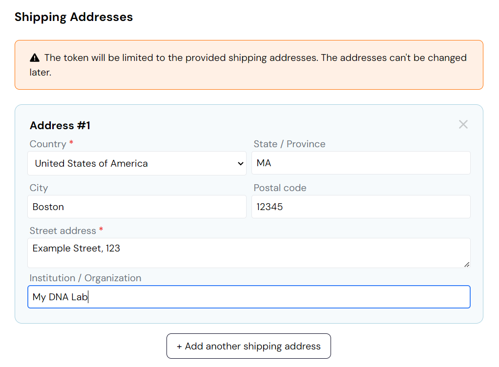{group="identifying"}

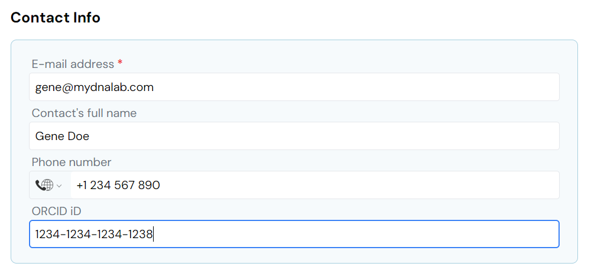{group="identifying"}

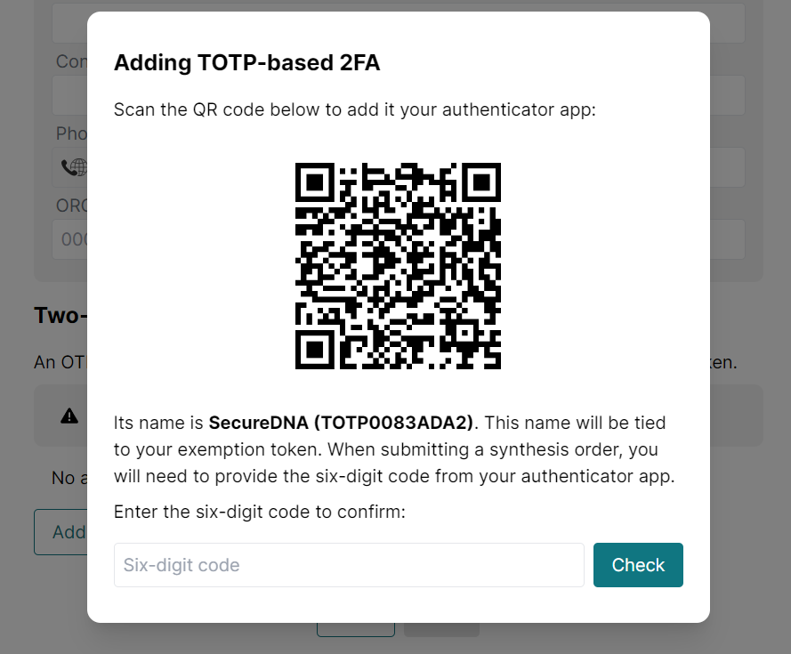{group="identifying"}

:::

### Specifying an exemption

Show gallery

::: {layout-ncol=2}

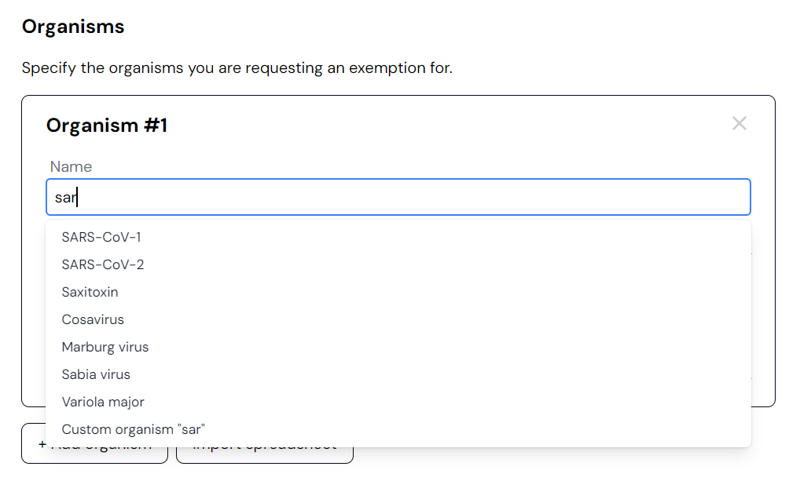{group="specifying"}

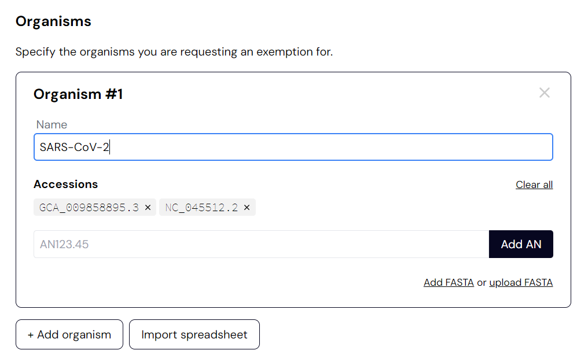{group="specifying"}

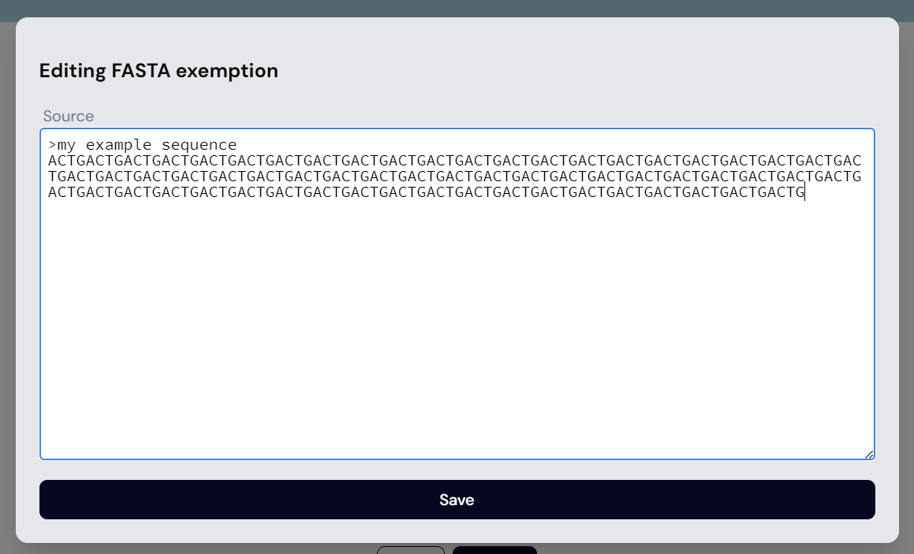{group="specifying"}

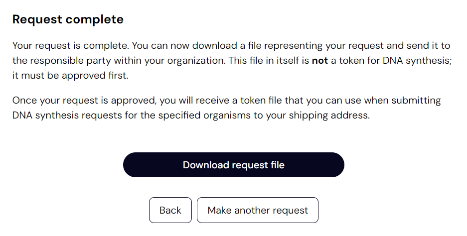{group="specifying"}

:::

### Subsetting (optional, advanced)

Show gallery

::: {layout-ncol=2}

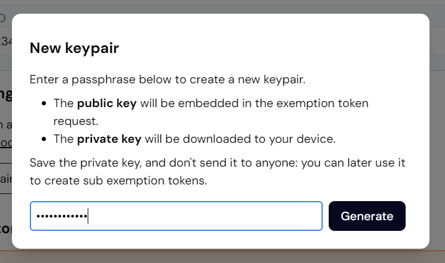{group="subsetting"}

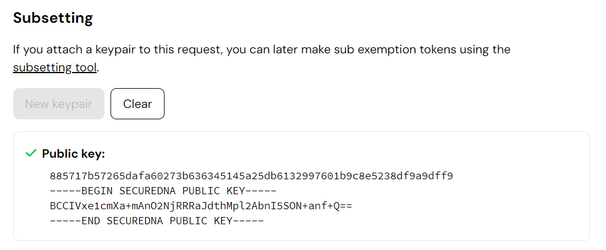{group="subsetting"}

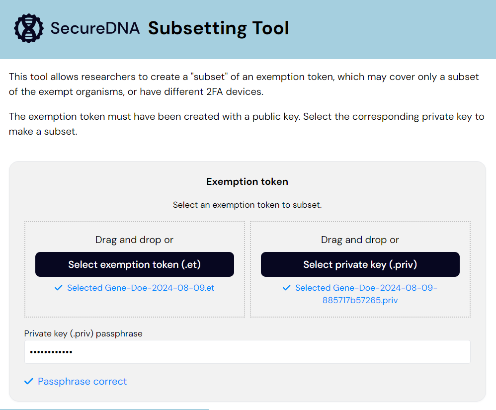{group="subsetting"}

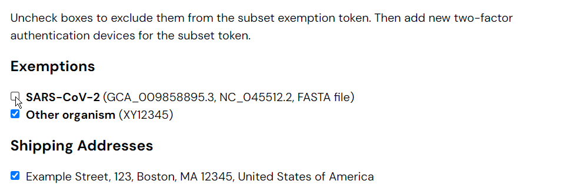{group="subsetting"}

:::

## Approval flow

Show gallery

::: {layout-ncol=2}

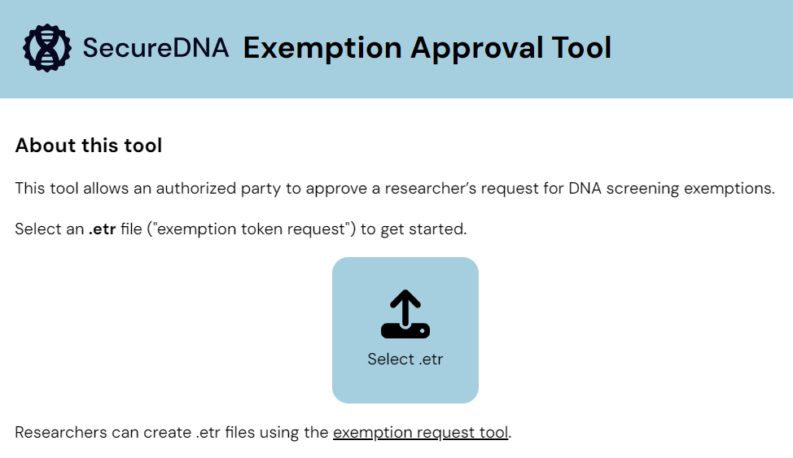{group="bsa"}

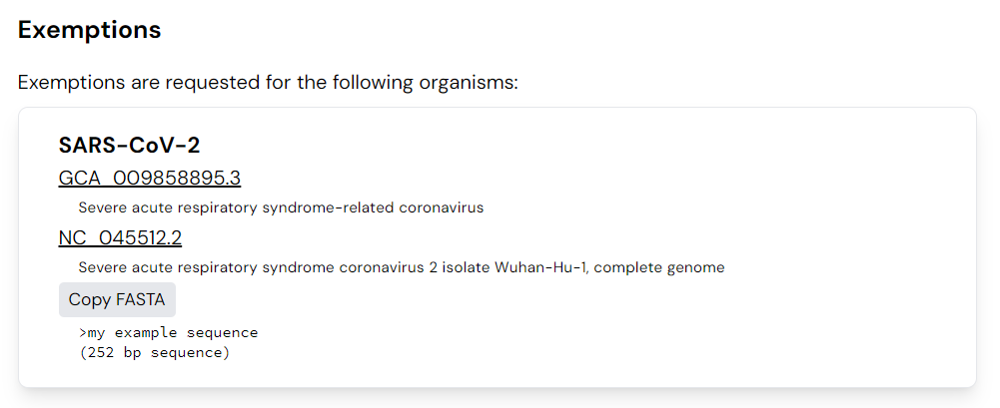{group="bsa"}

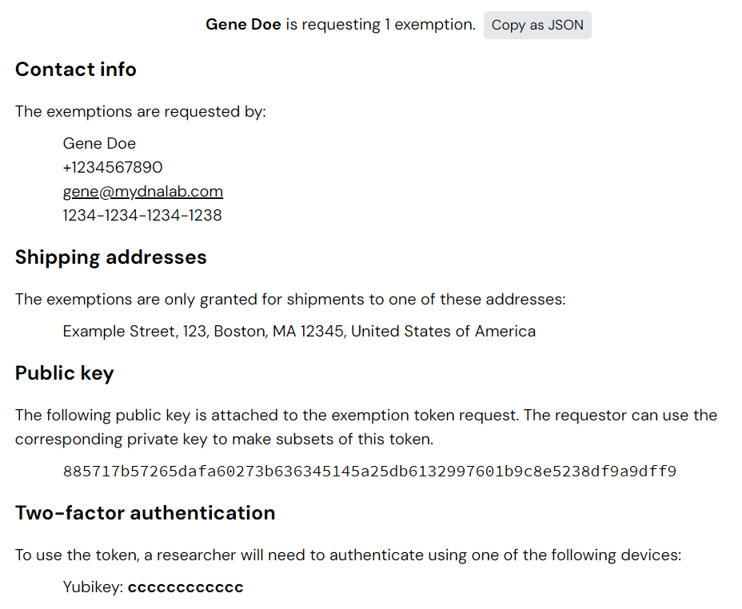{group="bsa"}

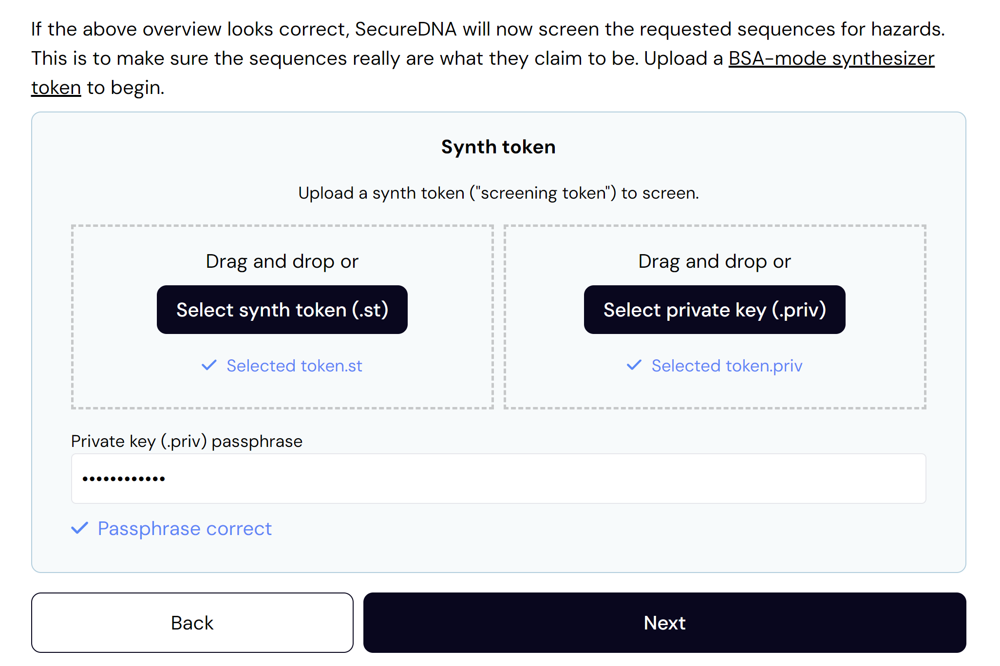{group="bsa"}

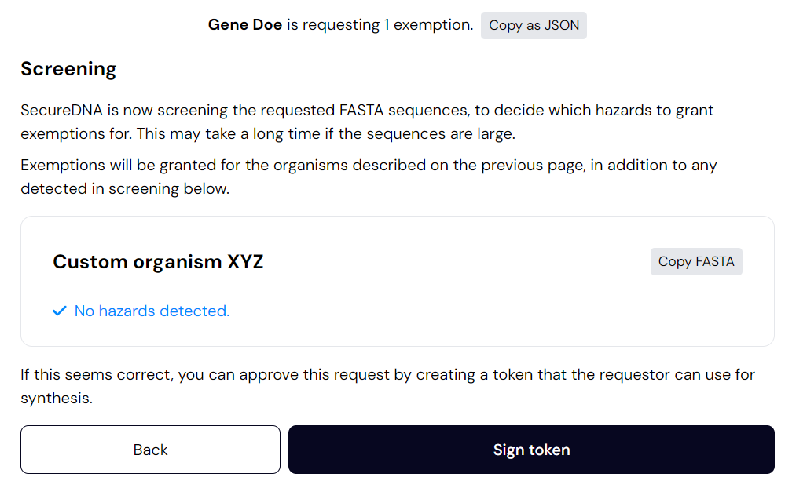{group="bsa"}

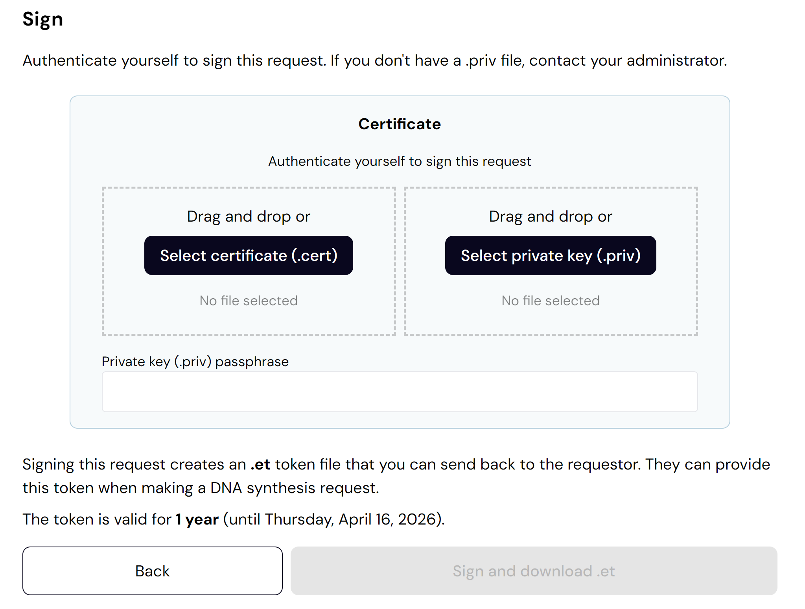{group="bsa"}

:::

